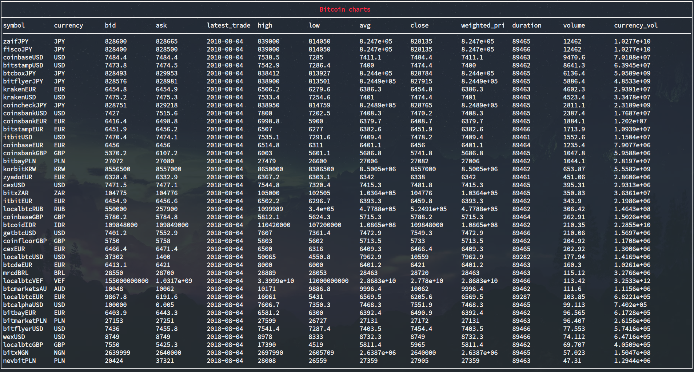

> Bitcoin Markets Data display in terminal.

 

Usage
-----

`./BitcoinMarket.sh`

Data
----

Markets data is provided by [Bitcoincharts](https://bitcoincharts.com/about/markets-api/).

TODO
----

* Enhance display (units etc.)
* Clean code
* Makefile for building 
* Acknowledgement
* Rename filename
